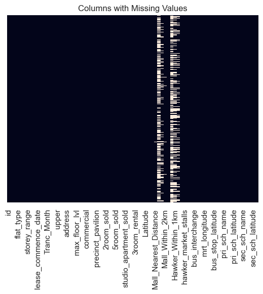

#   Singapore Housing Data and Kaggle Challenge

## Background

The Housing & Development Board (HDB) was set up on 1 February 1960, taking over from the Singapore Improvement Trust (SIT) which was set up by the British colonial government in 1927.

The main task of the HDB was to house the nation. From just 9% of people living in government flats in 1960, HDB flats today house over 80% of Singapore’s population. ([Source](https://dollarsandsense.sg/5-types-hdb-flats-not-longer-built-singapore/))

Many of the HDB flat owners purchase resale flats from the market instead of applying for new flats due to a number of constraints. In view of that, a good housing price prediction model provides a valuable tool for real estate agents, investors, and home buyers, providing insights into the current state of the housing market and helping to inform investment decisions.

For example, The "Singapore's Smarter Property Search" page [99.co](https://www.99.co/) released an instant property value calculation tool for their users:

This housing price prediction project aims to simulate an accurate and reliable model just like the one used by [99.co](https://www.99.co/) for valuation of a HDB resale flat. 

Linear Regression is used as it is an effective model to establish relationship between the resale price variable from explanatory variables associated with it. ([Source](https://www.knowledgehut.com/blog/data-science/linear-regression-for-machine-learning)) The model is trained using transaction data from 2012 to 2020 and will be evaluated using RMSE as the primary metric. 

## Problem Statement

The objective of the study is two folds:

- First, to create a prediction model that accurately predict house price with reasonable error margin.
- Second, to ensure that the model generalized well to perform equally well on the data points that it never sees before.

Aside, I hope to help realters and investors to understand which feature(s) are more crucial to determine the HDB resale price in Singapore.

#### The problem is approached with the following steps:

## 1. Data Cleaning
- Handling missing values by dropping less significant columns yet with a high percentage of missing values:

For instance, referring to the above showing the columns with missing values, it is considered safe to drop features like `Mall_Within_500m` `Mall_Within_1km` `Mall_Within_2km`. 

- Handling missing values by dropping rows (where the percentage of missing values is low)
- Handling missing values by imputing using median value (when the values are skewed)

## 2. Explotary Data Analysis

- To identify the correlation between features and the predicting variables, in this case the resale price of HDB.
- To provide evidences for feature selection process.

## 3. Preprocessing

Linear Regression only takes numerical values to model, we need the following steps for preprocessing before model training:

- Check if the numerical features are meaningful to the model. For instance, locational features with numercial input should be removed.
- Categorical features (nominal and ordinal) will be converted into numerical representations by the means of One Hot Encoding (binarize the category into an array of 1 and 0 to represent the feature) or Ordinal Encoding (convert category to numerical values which retains the order of category).
- Selection of significant features
- Remove features with majority counts for a single category. This feature may not provide extra information as most data falls under the same category.
Regularization using Lasso, Ridge and Elastic Net to penalize unnecessary features is important.

## 4. Modeling

## 5. Model Evaluation

## 6. Prediction

