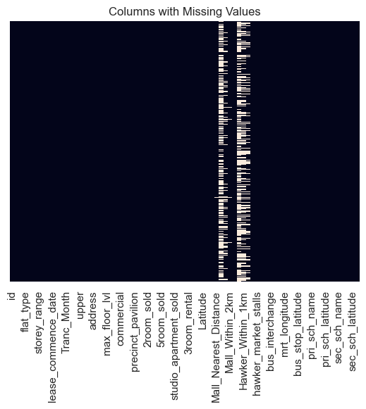
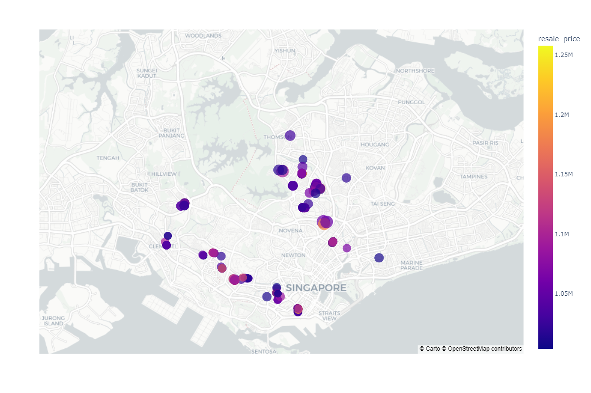
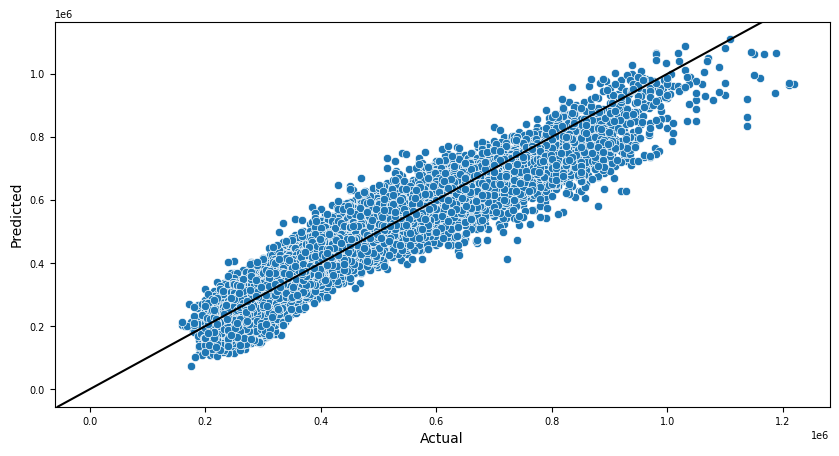
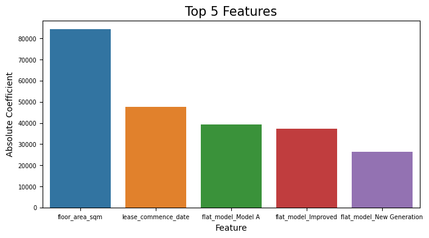
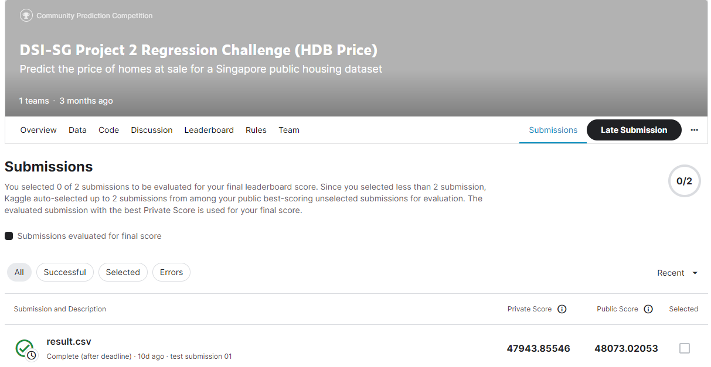

#   Singapore Housing Data and Kaggle Challenge

## Background

The Housing & Development Board (HDB) was set up on 1 February 1960, taking over from the Singapore Improvement Trust (SIT) which was set up by the British colonial government in 1927.

The main task of the HDB was to house the nation. From just 9% of people living in government flats in 1960, HDB flats today house over 80% of Singapore’s population. ([Source](https://dollarsandsense.sg/5-types-hdb-flats-not-longer-built-singapore/))

Many of the HDB flat owners purchase resale flats from the market instead of applying for new flats due to a number of constraints. In view of that, a good housing price prediction tool provides a valuable insights for potential buys, especially for young couples who are earnest in owning a value for money place to stay as soon as possible. 

For example, The "Singapore's Smarter Property Search" page [99.co](https://www.99.co/) released an instant property pricing tool for their users:

This housing price prediction project aims to simulate an accurate and reliable model just like the one used by [99.co](https://www.99.co/) for valuation of a HDB resale flat. 

Linear Regression is used as it is an effective model to establish relationship between the resale price variable from explanatory variables associated with it. ([Source](https://www.knowledgehut.com/blog/data-science/linear-regression-for-machine-learning)) The model is trained using 150,000 sets of transaction data containing 77 features from 2012 to 2020 and will be evaluated using RMSE as the primary metric, and R-square score as the secondary metric. 

## Problem Statement

The objective of the study is two folds:

Aside from creating a prediction model that accurately predict house price with reasonable error margin, I hope to help young couple buyers to understand better about the price drivers and narrow down to suitable flats within their budget. 

#### The problem is approached with the following steps:

### 1. Data Cleaning
- Handling missing values by dropping less significant columns yet with a high percentage of missing values:

For instance, referring to the above showing the columns with missing values, it is considered safe to drop features like `Mall_Within_500m` `Mall_Within_1km` `Mall_Within_2km`. 

- Handling missing values by dropping rows (where the percentage of missing values is low)
- Handling missing values by imputing using median value (when the values are skewed)

### 2. Explotary Data Analysis

- To identify the correlation between features and the predicting variables, in this case the resale price of HDB.
- To provide evidences for feature selection process.
- To identify the outliers and decide what to do with them. 

As we identified where the price outliers ($1mil flats) are located (see the map below):

It is noticed the top priced flats are all from the "prime locations", which means they are a good reflection of the high values of the location. Including these data will improve the variance and guide our model for a better prediction. In short, these price "outliers" should not be removed for data modeling. 

### 3. Preprocessing

Linear Regression only takes numerical values to model, we need the following steps for preprocessing before model training:

- Check if the numerical features are meaningful to the model. For instance, locational features with numercial input should be removed.
- Categorical features (nominal and ordinal) will be converted into numerical representations by the means of One Hot Encoding (binarize the category into an array of 1 and 0 to represent the feature) or Ordinal Encoding (convert category to numerical values which retains the order of category).
- Selection of significant features
- Remove features with majority counts for a single category. This feature may not provide extra information as most data falls under the same category.
Regularization using Lasso, Ridge and Elastic Net to penalize unnecessary features is important.

### 4. Modeling

A few models are tested and evaluated based on the RMSE (primary metric) and R-square score (secondary metric):
- Base model (using the average of the resale price in the training data)
- Ridge Regression with Standard Scaler
- Lasso Regression with Standard Scaler
- ElasticNet Regression with Standard Scaler

### 5. Model Evaluation

Results of Linear Model trainings are as follows:

**1. Ridge Regression: **
- R2-score on training set: **0.888**
- R2-score on validation set: **0.887**
- RMSE on training set : **47907.6**
- RMSE on validation set: **48089.7**

2. Lasso Regression: 
- R2-score on training set: 0.888
- R2-score on validation set: 0.886
- RMSE on training set : 48060.8
- RMSE on validation set: 48207.6

3. ElasticNet Regression: 
- R2-score on training set: 0.496
- R2-score on validation set: 0.496
- RMSE on training set : 101835.3
- RMSE on validation set: 101446.0

Before applying **1.Ridge Regression** being the best trained model for the price prediction, a visualisation of predicted values vs. actual values in the validation set is helpful to understand if the model performs well:

#### Top features derived from the model based on coefficients:

#### Model Limitations:

- **Multicollinearity** among the selected features was not analysed. Although this does not affect the regression estimates, it makes them vague, imprecise, and unreliable. Thus, it can be hard to determine how the independent variables influence the dependent variable individually. This inflates the standard errors of some or all of the regression coefficients. ([Source](https://www.investopedia.com/terms/m/multicollinearity.asp#:~:text=Although%20multicollinearity%20does%20not%20affect,all%20of%20the%20regression%20coefficients.))

- The coefficients in linear models are supposed to give us an idea of the magnitute of impact by each feature in explaining the variation in the target variable. However, the interpretation of the coefficients can be affected by the **scaling of the features**. 

- Retraining of the model using **different sets of features** could optimise the model preformance. 

## 6. Prediction
- Apply the best performing model on the predicting set to get the predictions. 
- Kaggle submission:

## Conclusions

I started with a dataset of 150,000 transactions and 77 features with the goal to create accurate yet generalisable prediction model. After performing data cleaning, EDA, and preprocessing (feature selection and One Hot Encoding), a model was trained with an acceptable RMSE score (RMSE: 47907.6) and generelized well across the validation set (RMSE:48089.7).

The top features impacting the price derived from the model are: **flat size**, **flat age** and **flat model**. 

In light of these findings, for potential young couples who are looking for a good budget buy, it is advised to compromise one or more of these features based on their specific needs. For instance, with more people working from home nowadays, young couples may need more space at home than ever. In such case, they may want to consider flats with shorter lease remaining years for better utility value.  

## Recommendations for Further Studies

- A larger dataset including more features of the flats, like direction of window facing, whether or not it is close to a place of worship, may add to the variance level of the data and provide a better fit model.

- External factors impacting the price fluctuations should be taken into consideration for understanding the HDB price better. For instance, government cooling policies, macro economic trend, Covid outbreak, supply/demand balance etc. 

